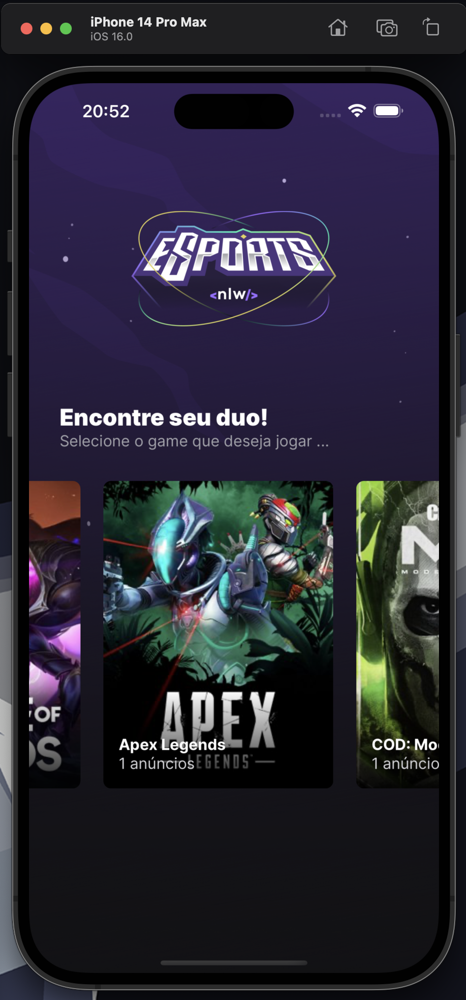
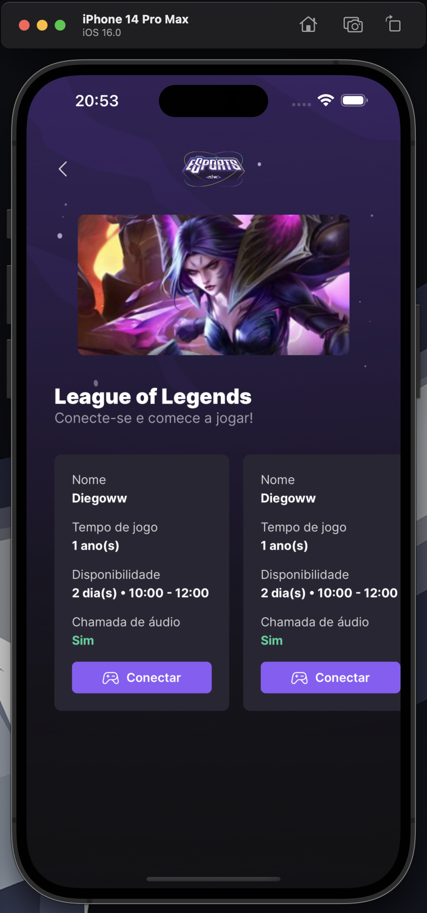
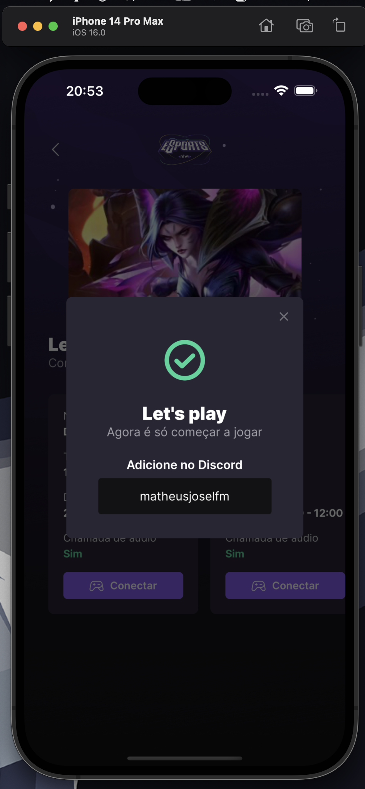
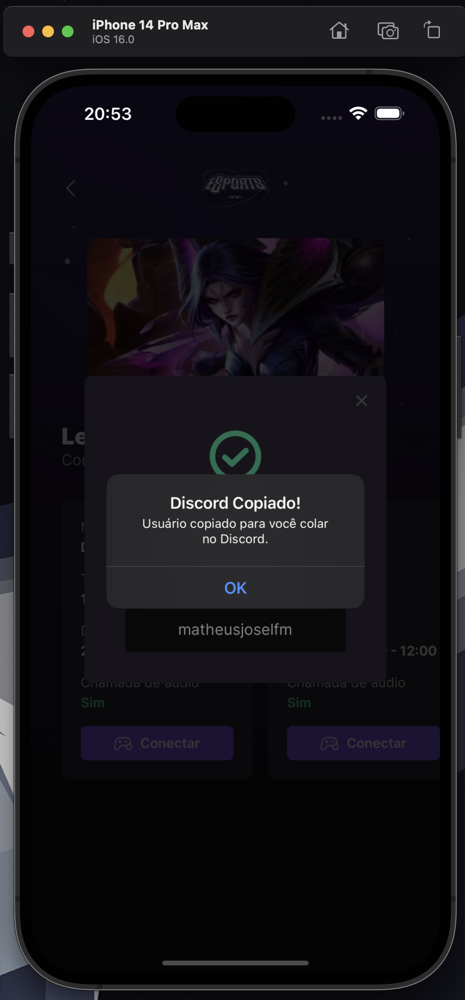

<div id='top'>

# NLW eSports - Trilha Ignite | Rocketseat

</div>

<p align="center">
  <a href="#memo-about">About</a> &#xa0; | &#xa0; 
  <!-- <a href="#sparkles-features">Features</a> &#xa0; | &#xa0; -->
  <a href="#white_check_mark-requirements">Requirements</a> &#xa0; | &#xa0;
  <a href="#checkered_flag-starting">Starting</a> &#xa0; | &#xa0;
  <a href="#bookmark-use-cases">Use Cases</a> &#xa0; | &#xa0;
  <a href="#memo-license">License</a> &#xa0; | &#xa0;
  <a href="https://github.com/itzmatheus" target="_blank">Author</a>
</p>


## :memo: About

During the event **NLW eSports** we have developed a _web_ and _mobile_ platform where Gamers can find partners for the most popular games being displayed on Twitch. This project is part of the Ignite Trail and we learned about NodeJS with Express, React with TypeScript and React Native with Expo.

The web application allows us to create ads and find game partners (or duos). In the mobile application, we can access those ads to view the informations about each player and copy their Discord username to clipboard, so we can add them to our friends list.

This project was developed during the event **#NLWtogether** hosted by [Rocketseat](https://www.rocketseat.com.br) with the help of the instructors [Diego Fernandes](https://github.com/diego3g) and [Rodrigo Gonçalves](https://github.com/rodrigorgtic).

<!-- prettier-ignore -->
| 🪧 Informations   |     |
| --------------- | --- |
| ✨ Name         | **Mobile App NLW eSports** - Rocketseat |
| 🏷️ Technologies  | TypeScript, React/Native and Expo|
| 💻 Api version  | [Click here](https://github.com/itzmatheus/nlwt-ignite-eSport-server) |
| 📲 Web version | [Click here](https://github.com/itzmatheus/nlwt-ignite-eSport-web) |
| 🔥 Design       | [**Figma**](https://www.figma.com/community/file/1150897317533332617) |


## 🩹 Improvements needed

The project was totally developed according to the instructions given, no aditionals. In the future, it would be interesting to add the following implementations:

- Notifications;
- Login with Discord;

## :white_check_mark: Requirements

Before starting 🏁, you need to have [Git](https://git-scm.com), [Node](https://nodejs.org/en/) v16.14.0 installed and [Expo](https://docs.expo.dev/get-started/installation/)

Emulators:
  - IOS: [XCode](https://developer.apple.com/xcode/)
  - Android: [Android Studio](https://developer.android.com/studio/run/emulator)
  - Use you own iPhone or Android phone: [ExpoGo](https://docs.expo.dev/workflow/run-on-device/)

Suggest: https://github.com/nvm-sh/nvm

## :checkered_flag: Starting

```bash
# Clone this project
$ git clone https://github.com/itzmatheus/nlwt-ignite-eSport-mobile
# Access
$ cd nlwt-ignite-eSport-mobile
# Install dependencies
$ npm install
# Run local (Use you own phone)
$ npm start
# Run on IOS Emulator (Require XCode Emulator. Only works in MacOS System)
$ npm ios
# Run on Android Emulator (Require Android Studio Emulator)
$ npm android
```


## :bookmark: Use Cases

#### List games

Homepage to see all registered games and the amount of ads already published.



#### List Ads By Game

When you click in game photo is open a new page to you see all published ads info included in game selected.



#### See Discord User

When you click in _Conectar_ button is open a modal to you see user Discord and copy to your clipboard.



---

## :memo: License

This project is under license from MIT. For more details, see the [LICENSE](LICENSE) file.


<a href='#top'>🔼 Back to top</a>

---
Developer by [@Matheus Leite](https://itzmatheus.github.io/portfolio/)

Readme by [@sucodelarangela](https://angelacaldas.vercel.app)
